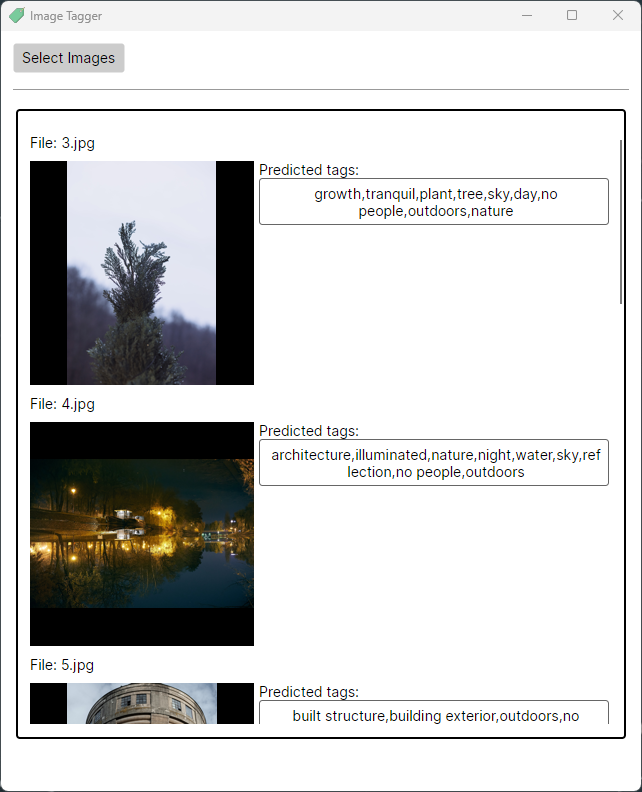

# Image Tagger

Image Tagger is a simple software application for predicting an image's keywords using a deep learning model based on resnet.

It allows photographers to automate the image tagging process. 📸

---

## Instructions

Open the application and click "Load Images" then wait for the images prediction to finish. You will get the keywords in the text field, and you can copy them to the clipboard.

Alternatively, you can run the application from the command line and pass the path to the image as an argument.

```bash
ImageTagger.UI "\Users\dnutiu\Pictures\image.jpg"
```

You can download the application from the [releases page](https://github.com/dnutiu/image-tagging/releases).



Photo credit: [https://unsplash.com/@ndcphoto](https://unsplash.com/@ndcphoto)

## Development

If you want to build the application yourself, you will need Dotnet 7.0 and to place the `AIModels` 
folder from the release archive in the folder `\ImageTagger\ImageTagger.Core\AIModels`.

The release archive is in the [releases page](https://github.com/dnutiu/image-tagging/releases).

### Building from source

To build from source you will need .NET Core 7.0 and optionally make.

Then change directory to the root folder and run:

**Important**: Ensure that you've downloaded a released build and grab the `AIModels` folder from the archive
and place it in the `\ImageTagger\ImageTagger.Core\AIModels` folder.

```bash

```bash
make publish-all
```
The application will be published in the `publish` folder: `ImageTagger.UI\bin\Release\net7.0\publish`.

# Blog

You can visit my tech blog at [https://blog.nuculabs.dev](https://blog.nuculabs.dev).
