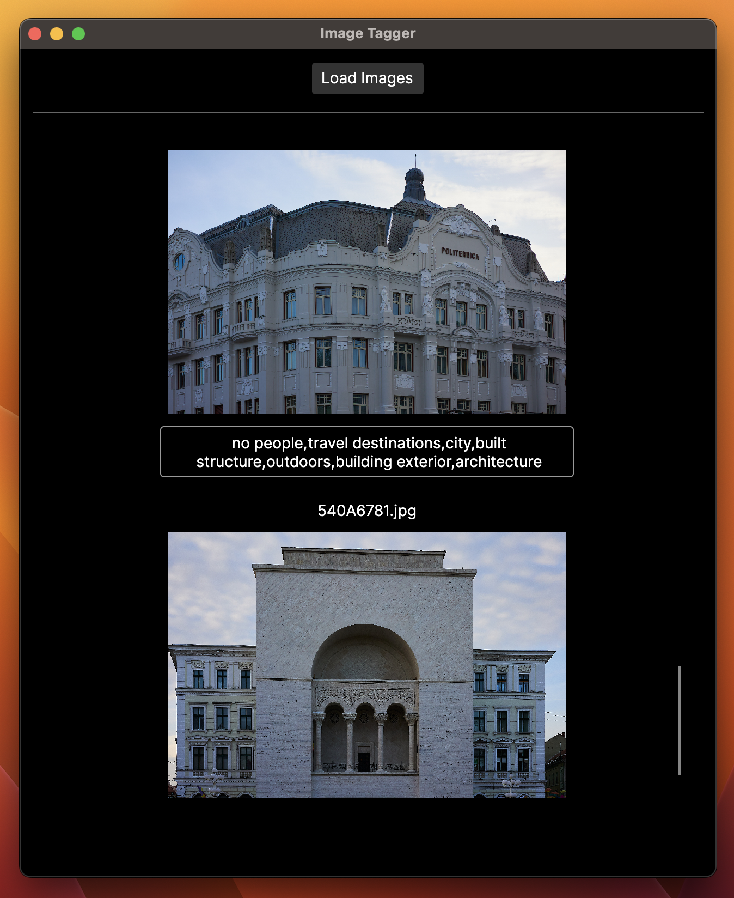

# Image Tagger

Image Tagger is a simple software application for predicting an image's keywords using a deep learning model based on resnet.

It allows photographers to automate the image tagging process. 📸

---

## Instructions

Open the application and click "Load Images" then wait for the images prediction to finish. You will get the keywords in the text field, and you can copy them to the clipboard.

You can download the application from the [releases page](https://github.com/dnutiu/image-tagging/releases).

Photo credit: [https://unsplash.com/@denispixels](https://unsplash.com/@denispixels)

### Development

If you want to build the application yourself, you will need Dotnet 7.0 and to place the `AIModels` 
folder from the release archive in the folder `\ImageTagger\ImageTagger.Core\AIModels`.

You can visit my blog at [https://blog.nuculabs.dev](https://blog.nuculabs.dev).